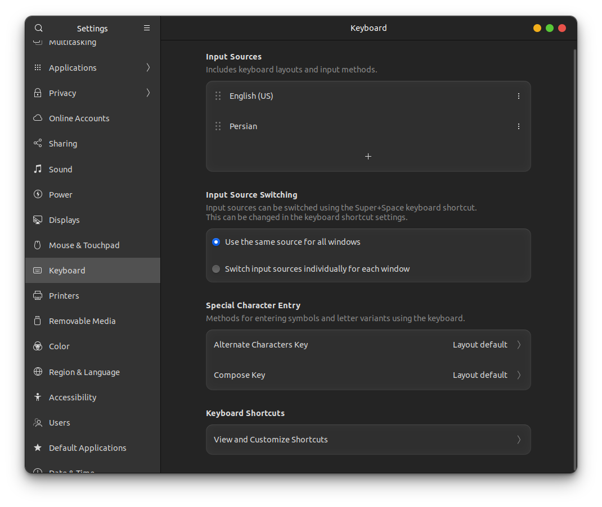
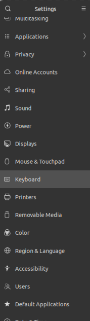
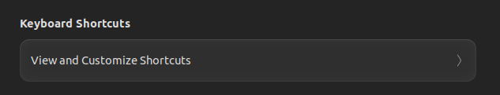
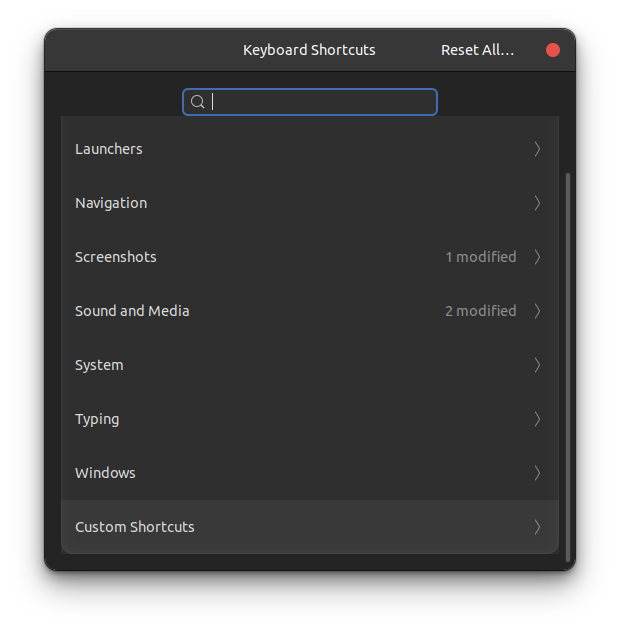
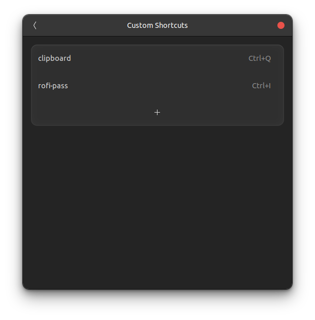
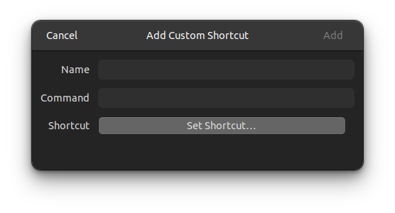

## clipboard-hotkeys

Linux Password Manager is a simple tool that allows users to copy passwords to the clipboard with the press of a hotkey.

This project aims to provide an easy-to-use solution for users who frequently need to access their passwords on Linux systems.


----

### Install dependency

You must install `xclip` for using this script.

```
cd clipboard-hotkeys
sudo chmod a+x dependency.sh
bash dependency.sh
```

----

### Add custom hotkey

There are several step to add custom hotkey 

1. Go to **setting**




2. Keyboard **setting**
   


3. Keyboard shortcuts --> **view and customize shortcuts**



4. Scroll down --> **Custom shortcut**


5. Click on **+**



6. enter a name for this shortcut + enter command to run **script.sh** + set shortcut 




Now press shortcut to copy password to clipboard .